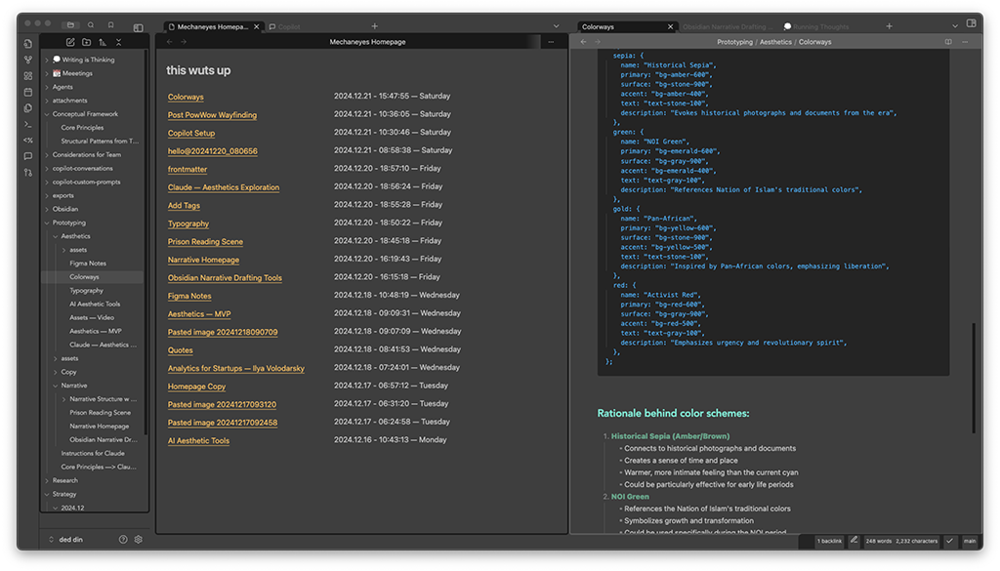

# Obsidian Mechaneyes Homepage

Adapted from the [Obsidian Starter Plugin](https://github.com/obsidianmd/obsidian-starter-plugin). 

Adds a homepage to Obsidian with a list of recently modified notes.

It's just that atm, but will evolve over time.

## How to use

- Clone this repo.
- Make sure your NodeJS is at least v16 (`node --version`).
- `npm i` or `yarn` to install dependencies.
- `npm run dev` to start compilation in watch mode.

## Manually installing the plugin

- Copy over `main.js`, `styles.css`, `manifest.json` to your vault `VaultFolder/.obsidian/plugins/your-plugin-id/`.

## API Documentation

See https://github.com/obsidianmd/obsidian-api
